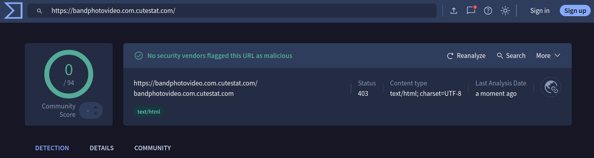

# Phone Security Online

## Topic 1: Stay calm, don't panic

**Wary:** Listen, I recently got a strange message. Apparently my electricity would be cut off if I didn't pay right away. I was really scared.

**Curious:** Did you pay?

**Wary:** Fortunately not! But my heart was pounding. Only later did I think - maybe it's a scam?

**Curious:** You know, my neighbor clicked on such a link and lost money. She said she was ashamed to talk about it.

**Wary:** That's strange - why should we be ashamed? It's the criminals who are scamming us, not us doing something wrong.

**Curious:** Exactly, but scams work in many ways. Either they send us fake messages - pretending to be a bank, police, energy company, doctor, or someone from the family. Sometimes they call directly. Or we ourselves go to dangerous websites.

**Wary:** How do we go to dangerous websites? I certainly don't look for anything bad on purpose!

**Curious:** But sometimes we want to watch a movie for free, or download something... And we end up on a website that looks normal, but steals our data. And you know what's the worst part? Criminals know that if a website offers something embarrassing - like illegal movies or adult content - we won't go for help because we'll be ashamed.

**Wary:** That's true... But why do these scams work at all?

**Curious:** Because they exploit our emotions! I saw a talk about this.[1] Criminals want us to feel **fear** - they write "we'll close your account!", "police issued a warrant!", "your electricity will be cut off!". Or **greed** - they write that you won a prize or they have an attractive investment for you. They even exploit **love** - we meet someone online, we have nice conversations, and after a few months that person suddenly needs money. And sometimes they play on **shame** - that's what we were talking about, they count on us being ashamed to ask for help because the scam happened on an embarrassing website.

**Wary:** Indeed, when I got that message about electricity, I immediately felt fear and wanted to deal with it quickly. I wasn't thinking calmly.

**Curious:** That's exactly what they want! They create a sense of urgency - they want us to act under the influence of emotions, before we think or ask someone for advice.

**Wary:** And you know what else? Someone called me from "the bank" saying my card was blocked and I had to urgently give them my password.

**Curious:** That's a classic scam! And here's the important part - just **hang up**. Even if the caller sounds professional. Most important: a real bank NEVER asks for your password over the phone—ever. If something is wrong with your card, call the number from the official bank website. And listen, this is important - virtually everyone gets such calls. It doesn't mean you did something wrong. Criminals call millions of people, hoping someone will fall for it.

**Wary:** I thought it was just me...

**Curious:** No, no! They scam young and old. Technical people also get fooled, because criminals are professionals. If someone scammed you - it's not your fault.

**Wary:** Good to hear that. But what should I do when such a message comes and I feel that fear?

**Curious:** That's your warning. Don't act right away. You need time to verify it.

**Wary:** Verify? But how?

**Curious:** First of all - don't panic and don't be ashamed!

**Wary:** What should I do?

**Curious:** Call the official contact number of the organization it concerns - not the number from the suspicious message.

**Wary:** What if it's an energy company?

**Curious:** Find the number on their website or bill. If it's an ad for a miracle drug - ignore it completely, real prescription drugs are prescribed by a doctor.

**Wary:** And then?

**Curious:** Tell someone trusted and tech-savvy - they'll help you figure out what to do next and change passwords if needed.

**Wary:** Good to know. Next time I'll be calmer.

**Curious:** Yes, staying calm is our best defense!

### References

[1] Watch this talk which uncovers some of the methods criminals use for online scams: [This Is What Happens When You Reply to Spam Email](https://www.youtube.com/watch?v=_QdPW8JrYzQ)

### Quiz

<b>❓ Question 1</b>: True or false: Criminals exploit emotions such as fear, greed, love, and shame to manipulate victims.

**Type:** true-false
**Answer:** True

**Explanation:** Criminals deliberately evoke strong emotions (fear, greed, love, shame) so their victims act impulsively, without thinking. When we feel strong emotions, we can't think clearly and it's easier to scam us.

<b>❓ Question 2</b>: True or false: If we receive scam messages, it means we did something wrong.

**Type:** true-false
**Answer:** False

**Explanation:** Virtually everyone online receives scam messages. It doesn't mean we did something wrong. Criminals send millions of messages, hoping someone will respond. They scam young and old - it's not your fault.

<b>❓ Question 3</b>: True or false: Scams can only come through fake SMS and email messages.

**Type:** true-false
**Answer:** False

**Explanation:** Scams work in two ways: (1) Criminals send fake messages (SMS, email, phone calls), or (2) You yourself go to dangerous websites (for example offering illegal movies or adult content). Both ways are dangerous.

<b>❓ Question 4</b>: What should a person who fell victim to a scam do? Select all correct answers.

**Type:** multiple-choice

**Answers:**
- ✓ Call the official number of the organization (not the number from the suspicious message)
- ✗ Be ashamed and tell no one
- ✓ Tell someone trusted and tech-savvy
- ✗ Pay immediately to solve the problem

**Explanations:**
- **Call the official number of the organization (not the number from the suspicious message)**: This is the correct action. Call the official contact number of the organization.
- **Be ashamed and tell no one**: Don't be ashamed! It's very important to ask for help. Many people fall victim to scams and being ashamed only helps the criminals.
- **Tell someone trusted and tech-savvy**: This is the correct action. A trusted tech-savvy person will help you assess the situation and take next steps, like changing passwords.
- **Pay immediately to solve the problem**: No! If someone asks for immediate payment and creates urgency, it's probably a scam. Always verify through official channels.

## Topic 2: Verify before you trust

**Wary:** Remember how you said I should verify messages? Well, I just got an SMS saying my package is waiting at FedEx and I should click a link to pick it up. How do I check that?

**Curious:** Good question! This is exactly the moment when you need to slow down and think. Don't click that link!

**Wary:** But how can I check if my package is waiting if I don't click?

**Curious:** That's what criminals teach us - to use the information they gave us. It could be a trap! You need to verify this on your own.

**Wary:** On my own? What do you mean?

**Curious:** Instead of clicking the link from the SMS, if you have the FedEx mobile app installed, you can open it and check all your packages. You can also search using the package number on the official FedEx website.

**Wary:** Oh! Or could I call FedEx instead?

**Curious:** Yes, but don't call the number from that suspicious message. Find the official FedEx number on the FedEx website, because criminals often put their own phone numbers in fake messages.

**Wary:** I understand. What if the message was from an online shop?

**Curious:** Exactly the same principle! If you get a message supposedly from an online shop:
- Don't click the links in the message.
- Don't call the numbers in the message.
- Don't reply to the message.

Instead:
- Find the shop's website by typing the address manually (or searching for it independently).
- Use the shop's official mobile app if you have it installed.
- Or call the customer service number from their official website (not from the suspicious message).

**Wary:** But sometimes I want to know if a link is fake before clicking. Can I check that somehow without clicking?

**Curious:** Yes! But here's the thing - a link might show one address but take you to a completely different place. It's like an envelope with a bank logo on the outside, but the letter inside is from criminals. You need to check where the link actually goes.

**Wary:** How do I check that?

**Curious:** On your phone, you can long-press your finger on the link - hold it for one second. Then you'll see the real address the link leads to, but don't click it!

**Wary:** And what should I look for?

**Curious:** You need to understand what a website address is. It's the part before the first forward slash. For example, the website address of www.bhphotovideo.com/credit-cards is www.bhphotovideo.com. That's the part you need to check if it's real. Criminals use tricks. For example:
- Real B&H Photo Video site: www.bhphotovideo.com
- Fake site: bandphotovideo.com.cutestat.com

See the difference? They made it look similar but added extra parts! For details on how to recognize malicious links, watch this video:[1]

**Wary:** How can I check if a link is fake?

**Curious:** There are ways, but they don't always work perfectly.

The website www.virustotal.com offers one way. You can paste there in the "URL" tab the suspicious link (still without clicking it!) and check if it's detected as dangerous.

**Wary:** Let me try! I have this link from an email about the online shop. I'll paste it into VirusTotal... Oh! Like you said, the link looks suspicious, but VirusTotal showed zero threats and marked it green!

**Curious:** Exactly! Some scams might not be detected there. That's why you need to be familiar with the real addresses of websites you use, so you can judge yourself whether an address looks suspicious.

**Wary:** What about scam phone calls? How do I check those?

**Curious:** You can check them on the 800notes.com website (or you can also try www.whitepages.com). You type in the phone number and see if other people reported it as a scam. But like with VirusTotal, a number might be dangerous even if it's not marked as suspicious there.

**Wary:** What about using artificial intelligence? You can ask it questions about things.

**Curious:** Artificial intelligence can give wrong advice. And it gets worse - more and more people allow AI to do things on their phones like: sending messages, making payments, reading your data.

If you give AI that kind of access, it can:
- Send a message to the wrong person or a criminal.
- Make a money transfer to a criminal's account.
- Give you a wrong phone number.

So treat AI like a child - it can make mistakes and do unexpected things. Never give AI access to money, important messages, or private data. Always verify anything AI did for you.

**Wary:** What about paying online?

**Curious:** If possible, don't save your payment card details on websites.

**Wary:** But that means I have to type my whole card number every time!

**Curious:** Yes, it's a bit inconvenient. But think about it - if criminals later hack the website, your card details won't be stolen because they're not saved there. Some websites require saving your card, but when you have the choice - don't save it.

**Wary:** So to summarize, verification means checking everything through official channels, and not through the information in the suspicious message.

**Curious:** Exactly! Don't click links blindly - always verify first. That's our best protection.

### References

[1] [How to analyze websites (URLs) in VirusTotal](https://www.youtube.com/watch?v=snCeY9QPH6A)

### Quiz

<b>❓ Question 1</b>: True or false: If we get a suspicious message from our bank, we should click the link in the message to verify if it's real.

**Type:** true-false
**Answer:** False

**Explanation:** Never click links from suspicious messages! Instead: (1) Visit the bank's website by typing the address manually, (2) Use your banking app if you already have it, (3) Call the number from the official bank website or your bank statement.

<b>❓ Question 2</b>: True or false: Tools like VirusTotal and 800notes detect all dangerous websites and phone numbers.

**Type:** true-false
**Answer:** False

**Explanation:** Tools like VirusTotal and 800notes are helpful, but they don't detect everything! Some scams might not be detected by these tools. You cannot rely only on these tools - you must also check the website address yourself.

<b>❓ Question 3</b>: True or false: To check on your phone where a link really goes, you should long-press your finger on it.

**Type:** true-false
**Answer:** True

**Explanation:** Correct! On your phone, you can long-press (hold your finger) on a link to see the real address it leads to, without clicking it.

<b>❓ Question 4</b>: True or false: A link can show one address but lead to a completely different place.

**Type:** true-false
**Answer:** True

**Explanation:** This is true! A link might display one address but take you somewhere else completely. It's like an envelope with a bank logo on the outside but a criminal letter inside. That's why you must check where the link actually goes.

<b>❓ Question 5</b>: True or false: Saving your payment card details on websites is always safe.

**Type:** true-false
**Answer:** False

**Explanation:** No! If possible, don't save your payment card details on websites. If the website is later hacked, your card information won't be stolen because it's not saved there. When you have the choice, it's safer not to save it.

## Topic 3: Protect your accounts

**Wary:** After all this talk about not trusting links in messages, I'm worried - what if criminals try to break into my accounts directly?

**Curious:** Accounts are another thing we need to protect. The first rule: NEVER share your password with anyone. A password is a secret word used together with your account identifier (for example your email address) to log in.

**Wary:** But what if my bank calls and needs to verify something?

**Curious:** Your bank will NEVER ask for your password. Never. They have their own systems to review your account. If someone asks for your password, they want to illegally pretend to be you (log in as you).

**Wary:** So I should never tell anyone my passwords?

**Curious:** Exactly. Not even family members. If you need help with something, they can guide you, but they don't need to see your password.

**Wary:** But I can't remember different passwords for every account!

**Curious:** That's the challenge. Each account needs a different password - if criminals steal one, they'll try it everywhere. Also, your email address is typically used when registering for other online services, so if criminals get into your email, they can reset passwords for all those accounts.[1] That's why your email password must be strong.

**Wary:** How do I create strong passwords I can actually remember?

**Curious:** Use a long sentence - like "My five speak Cats Japanese orbit!" That's much stronger than short passwords.[2] Make it weird and memorable, something you'll actually remember. You can use capital letters or numbers anywhere in the sentence. But don't use our example sentence - create your own sentence you'll remember!

**Wary:** This password is so long! But I would remember it because it's weird - and I don't have any cats!

**Curious:** Perfect! If you need more passwords, make them unique for each site by adding one or more words. This is not the most secure way, because the main part of the password repeats across different sites, but it's better than having simple, short passwords.

**Wary:** But what if I need to write them down, because I still can't remember them?

**Curious:** You can write passwords in a notebook kept safely at home, but obfuscate when writing them down. For example: remove a word, add a word, or change capitalization - but you need to remember your obfuscating trick when you type it.

**Wary:** Are there other ways to store passwords?

**Curious:** Yes, there are password managers[3] - software that stores and protects your passwords. But this is a more advanced topic.

**Wary:** So how many strong passwords do I actually need to remember?

**Curious:** Only two or three of the most important ones - your email, bank account, and password manager if you use one. For other, less important accounts, you can rely on the "Forgot password" feature when you need access, or use a password manager to handle them.

**Wary:** That's interesting! What about checking if my password is strong enough?

**Curious:** You can test password strength at Bitwarden's website,[4] for example, but NEVER test your real passwords! Only test similar examples to understand what "strong" means.

**Wary:** I heard about something called two-factor authentication (2FA). What's that?

**Curious:** Even if criminals steal your password, 2FA stops them. It's like having two locks on your door - you need two different keys to get in. After entering your password (first authentication factor), you need a second authentication factor - like a code generated by your phone.

**Wary:** So they'd need my password AND my phone?

**Curious:** Exactly! The code can come via SMS, or you can use an authenticator app.

**Wary:** What's the difference, and which one should I use?

**Curious:** Authenticator apps are more secure, because codes are generated directly on your phone. SMS codes can be intercepted by criminals. Use authenticator apps if you're comfortable with technology, but SMS is still better than nothing. But there is something important about any 2FA: when you enable it, the service gives you account access recovery codes. Print them or write them down obfuscated, and store them in a safe place!

**Wary:** Where do I download an authenticator app?

**Curious:** Download only from official app stores - Google Play or Apple App Store. Be careful with app names - malicious apps sometimes use similar names. For example, there might be a fake "Google Authentificator" next to the real "Google Authenticator". Only install apps from official providers like Google or Microsoft, or other large companies. And generally - install as few apps as possible. Each app is a potential security risk. Also keep your apps updated - updates often contain security fixes.

**Wary:** Why are these recovery codes so important?

**Curious:** If you lose your phone, those codes let you back into your account.

**Wary:** What about someone just picking up my phone?

**Curious:** Always use a screen lock - PIN or pattern. Some people prioritize convenience over privacy and use fingerprint or face unlock, which is convenient but stores your biometric data.

**Wary:** This seems like a lot to remember!

**Curious:** Start with these steps: 1) never show passwords to anyone, 2) use long memorable sentences for passwords, and 3) enable 2FA on your email (and remember to save the recovery codes!). Those steps already protect you better than most people online. This is all technically advanced, so ideally ask someone trusted to help you set it up.

### References

[1] You can check if your email address has been compromised in a data breach at [Have I Been Pwned](https://haveibeenpwned.com/) - this helps you know if you need to change your password.

[2] Older password guidance required uppercase, lowercase, numbers, and special characters. This made passwords hard for humans to remember but did not make them harder for computers to guess. In the past, this led to people using passwords criminals could predict - like "Maria1985!" This was security theater - it made people feel safer without improving security overall. NIST (U.S. National Institute of Standards and Technology) changed recommendations from complexity to length at [NIST Password Guidelines](https://www.nist.gov/cybersecurity/how-do-i-create-good-password). Many companies still haven't adopted these new guidelines ([Dumb Password Rules](https://github.com/duffn/dumb-password-rules))

[3] Password managers (advanced topic): For those who want to use a dedicated password manager, be careful with cloud-based options like [Bitwarden](https://bitwarden.com/) (open-source, free) or [1Password](https://1password.com/) - they store all your passwords online. Local/offline-only password managers are safer: [KeePass](https://keepass.info/) and [Password Safe](https://pwsafe.org/) (both open-source, free, offline only). If you use a cloud-based password manager, it must have 2FA enabled on your account. Never store your email password in the password manager - if it gets compromised, you don't want your email password to also be compromised! As an additional note: many websites offer "Login with Google" or "Login with Facebook" as sign-in options. While convenient, this creates a dependency - if you lose access to your Google or Facebook account, you lose access to all services linked to it, with no password reset option. Regular email registration is safer because you can still log in to those services with your password even if you lose access to your email.

[4] Bitwarden Password Strength Testing Tool: [https://bitwarden.com/password-strength/](https://bitwarden.com/password-strength/) - Remember: NEVER test your real passwords online!

### Quiz

<b>❓ Question 1</b>: True or false: Your bank may call and ask for your password to verify your identity.

**Type:** true-false
**Answer:** False

**Explanation:** Banks NEVER ask for your password. They have their own systems to review your account. If someone asks for your password, they want to illegally pretend to be you (log in as you).

<b>❓ Question 2</b>: True or false: A strong password must be a combination of uppercase and lowercase letters, numbers, and special characters.

**Type:** true-false
**Answer:** False

**Explanation:** This is obsolete advice that makes passwords hard for humans to remember but computers can still guess such passwords. What matters is password length - use a long memorable sentence.

<b>❓ Question 3</b>: True or false: It's safe to use the same password for multiple accounts as long as it's a strong password.

**Type:** true-false
**Answer:** False

**Explanation:** Each account needs a different password. If criminals steal one password (for example, from a hacked website), they'll try it on all your other accounts. If you use the same password everywhere, they'll get into everything.

<b>❓ Question 4</b>: True or false: Two-factor authentication (2FA) means that even if criminals steal your password, they still can't access your account.

**Type:** true-false
**Answer:** True

**Explanation:** With 2FA enabled, you need two things to log in: your password (first authentication factor) and a code from your phone (second authentication factor). Even if criminals have your password, they can't get in without the second authentication factor.

<b>❓ Question 5</b>: True or false: If you enable 2FA, you don't need to save the recovery codes because you can always get them later.

**Type:** true-false
**Answer:** False

**Explanation:** Recovery codes are usually shown only once when you first enable 2FA. You must save them immediately. If you lose your phone and don't have these codes, you lose access to your account.

## Topic 4: Protect your privacy

**Wary:** We've talked about protecting accounts from criminals. But what about privacy? I feel like apps and websites collect so much information about me.

**Curious:** You're right. Security and privacy are related but different. Security means protection from criminals taking over your accounts. Privacy is about controlling who knows what about you - where you go, what you search for, what you watch.

**Wary:** Why do companies collect this data?

**Curious:** Because they believe data is valuable. They collect your location, search history, videos you watch, websites you visit, who you contact, what you buy. They use this to target ads, or train artificial intelligence systems. However, you can somewhat limit the amount and type of information they collect about you.

**Wary:** Where should I start?

**Curious:** Start by limiting the number of installed apps and managing app permissions. Apps ask for permissions when you use features that need them - like accessing your camera, location, contacts, or your photos. Only allow what the app actually needs. Don't install apps that seem to require too much. Be especially wary about artificial intelligence apps - AI behavior is unpredictable and the market is unregulated. Such apps may process your data to create detailed profiles used for targeted advertising, manipulation, or surveillance.

**Wary:** How do I know what an app needs?

**Curious:** Use common sense. A calculator application on the phone doesn't need your location. A camera app needs your camera. But if a game asks for your contacts - that's suspicious. Say no. Be especially careful with location - many apps ask for it when they don't need it.

**Wary:** Which apps should have location permission?

**Curious:** Maps and navigation - yes, although they can work in a limited way without location. Location in a weather app is less necessary. Food delivery and ride-sharing need to know where you are. But social media, email, messaging, games - they don't need to know your location. Turn location off for those apps. Location is particularly sensitive - it can reveal where you live, work, seek medical care, and more. Many apps sell this data to others.

**Wary:** Can I change permissions after installing the application?

**Curious:** Yes! Go to your phone settings and review permissions for each app. Do this every few months - apps sometimes ask for new permissions after updates.

**Wary:** What about websites and browsers?

**Curious:** Many websites track everything you do - what you click, how long you stay, what you buy. They use so-called cookies (data snippets stored by the browser) to remember information about you.

**Wary:** How do I stop this?

**Curious:** You can't stop it completely, but you can reduce it. Start by tightening the privacy settings in your browser.[1]

**Wary:** Does being logged into services while browsing the internet matter?

**Curious:** When you're logged into any service - Google, Facebook, or others - while browsing, that company can track what you do across many websites. For browsing the internet use a separate browser where you are not logged into anything, or "Private" or "Incognito" browser mode.

**Wary:** What about AI? I've heard companies use our data to train AI systems.

**Curious:** Yes. Google may use your searches and emails, Meta your posts and photos, and various companies may use other data. Some services let you opt out of AI training in privacy settings. This is an area changing rapidly - new laws are emerging.

**Wary:** What about all these cookie banners on websites?

**Curious:** Most cookies track you across websites for advertising. You should reject the cookies. Look for a "Reject All" button instead of "Accept All". This takes more time on each website, but it reduces tracking. Important: we can't be certain websites fully respect your rejection - some might continue tracking.

**Wary:** But what about free apps and services? Are they safe?

**Curious:** They can be safe, but there's usually a trade-off. When a service is free, you are the product. The company may collect and sell your data to make money. If privacy matters to you, look for services that cost money instead - they may have different business models, based less on your data.

**Wary:** This all sounds like a lot of work.

**Curious:** Start with these steps: (1) Remove apps you don't use - each app is a potential risk, (2) Review app permissions - turn off location for apps that don't need it, (3) Reject cookies and tracking when websites ask, (4) Browse the internet without being logged into services, (5) Avoid revealing information about yourself online. This way you will protect your privacy better than most people.

### References

[1] Beyond browser settings, some people also use VPNs (Virtual Private Networks). VPNs hide your internet activity from your internet provider, but they don't protect you from tracking when you use websites - especially when you're logged in. If you use a VPN, make sure it's from a known company, because you're trusting them with your internet traffic. There are more advanced anonymity tools like Tor, but those are controversial.

### Quiz

<b>❓ Question 1</b>: True or false: Security and privacy are the same thing.

**Type:** true-false
**Answer:** False

**Explanation:** Security is about protection from criminals who break into your accounts. Privacy is about controlling who knows what about you - where you go, what you search for, what you watch. Both are important.

<b>❓ Question 2</b>: True or false: A calculator app should have location permission.

**Type:** true-false
**Answer:** False

**Explanation:** A calculator app does not need your location. You should deny location permission for apps that don't logically need it. Only allow permissions necessary for the app to work properly.

<b>❓ Question 3</b>: True or false: If a service is free, you are typically paying with your personal data.

**Type:** true-false
**Answer:** True

**Explanation:** When a service is free, you are usually the product. The company collects and sells your data to make money. Paid services may have different business models that rely less on selling your data.

<b>❓ Question 4</b>: True or false: Logging out of Google helps reduce tracking when you browse the internet.

**Type:** true-false
**Answer:** True

**Explanation:** When you're logged into Google, they know exactly who you are and can track all your activities. When not logged in, tracking is less likely to be tied to your identity. Websites can still track you, but Google can't easily connect it to your account.

