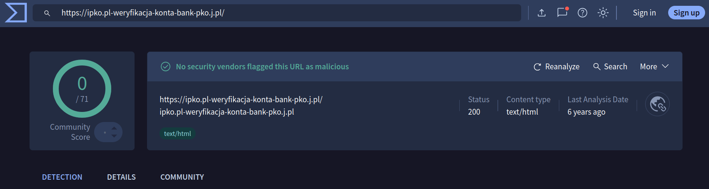

# Bezpieczeństwo telefonu w sieci

## Temat 1: Zachowaj spokój, nie panikuj

**Ostrożna:** Słuchaj, ostatnio dostałam dziwną wiadomość. Podobno mój prąd zostanie odcięty, jeśli nie zapłacę od razu. Strasznie się bałam.

**Ciekawska:** A zapłaciłaś?

**Ostrożna:** Na szczęście nie! Ale serce mi waliło. Dopiero potem pomyślałam - może to oszustwo?

**Ciekawska:** Wiesz, moja sąsiadka kliknęła w taki link i straciła pieniądze. Powiedziała, że wstydzi się o tym mówić.

**Ostrożna:** To dziwne - czemu mamy się wstydzić? To przecież przestępcy nas oszukują, a nie my robimy coś złego.

**Ciekawska:** Dokładnie, ale oszustwa działają na wiele sposobów. Albo oni wysyłają do nas fałszywe wiadomości - udają bank, policję, firmę energetyczną, lekarza, lub kogoś z rodziny. Czasem dzwonią bezpośrednio. Albo my same wchodzimy na niebezpieczne strony.

**Ostrożna:** Jak to na niebezpieczne strony? Ja przecież specjalnie nie szukam niczego złego!

**Ciekawska:** No ale czasem chcemy obejrzeć film za darmo, albo coś ściągnąć... I trafiamy na stronę, która wygląda normalnie, ale kradnie nasze dane. A wiesz co najgorsze? Przestępcy wiedzą, że jeśli strona oferuje coś wstydliwego - na przykład nielegalne filmy albo treści dla dorosłych - to nie pójdziemy po pomoc, bo będzie nam wstyd.

**Ostrożna:** To prawda... Ale dlaczego te oszustwa w ogóle działają?

**Ciekawska:** Bo wykorzystują nasze emocje! Widziałam film na ten temat.[1] Przestępcy chcą żebyśmy czuły **strach** - piszą "zamkniemy ci konto!", "policja wydała nakaz!", "twój prąd zostanie odcięty!". Albo **chciwość** - piszą że wygrałaś nagrodę albo mają dla ciebie atrakcyjną inwestycję. Wykorzystują nawet **miłość** - poznajemy kogoś w internecie, miło nam się rozmawia, a po kilku miesiącach ta osoba nagle potrzebuje pieniędzy. A czasem grają na **wstydzie** - właśnie o tym mówiłyśmy, liczą że będzie nam wstyd poprosić o pomoc, ponieważ oszustwo nastąpiło na wstydliwej stronie.

**Ostrożna:** Faktycznie, jak dostałam tę wiadomość o prądzie, od razu poczułam strach i chciałam szybko to załatwić. Nie myślałam spokojnie.

**Ciekawska:** Właśnie o to im chodzi! Tworzą poczucie, że trzeba działać natychmiast - chcą, żebyśmy działały pod wpływem emocji, zanim pomyślimy lub zapytamy kogoś o radę.

**Ostrożna:** A wiesz co jeszcze? Zadzwonili do mnie z "banku" i mówili że moja karta jest zablokowana i muszę pilnie podać moje hasło.

**Ciekawska:** To klasyczne oszustwo! I tutaj właśnie - po prostu **się rozłącz**. Nawet jeśli rozmówca brzmi profesjonalnie. Najważniejsze: prawdziwy bank NIGDY nie prosi o hasło przez telefon. Nigdy. Jeśli coś jest nie tak z twoją kartą, to dzwoń sama na numer z oficjalnej strony banku. I słuchaj, to ważne - właściwie każdy dostaje takie połączenia. To nie znaczy, że zrobiłaś coś źle. Przestępcy dzwonią do milionów ludzi, licząc że ktoś im uwierzy.

**Ostrożna:** Myślałam, że to tylko ja...

**Ciekawska:** Nie, nie! Oszukują młodych i starych. Techniczne osoby też dają się nabrać, bo przestępcy to profesjonaliści. Jeśli ktoś cię oszukał - to nie twoja wina.

**Ostrożna:** Dobrze o tym słyszeć. Ale co mam robić, kiedy przychodzi taka wiadomość i czuję ten strach?

**Ciekawska:** To jest twoje ostrzeżenie. Nie działaj od razu. Potrzebujesz czasu żeby to sprawdzić.

**Ostrożna:** Sprawdzić? Ale jak?

**Ciekawska:** Przede wszystkim - nie panikuj i nie wstydź się!

**Ostrożna:** A co powinnam zrobić?

**Ciekawska:** Zadzwoń pod oficjalny numer kontaktowy organizacji, której to dotyczy - a nie ten z podejrzanej wiadomości.

**Ostrożna:** A jeśli chodzi o firmę energetyczną?

**Ciekawska:** Znajdź numer na ich stronie lub rachunku. Jeśli to reklama cudownego leku - zignoruj to całkowicie, prawdziwe leki na receptę przepisuje lekarz.

**Ostrożna:** A potem?

**Ciekawska:** Powiedz komuś zaufanemu i sprawnemu technicznie - oni pomogą ci ocenić co dalej i zmienić hasła jeśli trzeba.

**Ostrożna:** Dobrze wiedzieć. Następnym razem będę spokojniejsza.

**Ciekawska:** Tak, spokój to nasza największa obrona!

### Źródła

[1] Obejrzyj dokument o jednym z największych polskich oszustów - ujawniający wiele metod, którymi do dziś oni się posługują: ["Konsul i inni" (1970)](https://www.youtube.com/watch?v=vZngAB3W9CE)

### Test

<b>❓ Pytanie 1</b>: Prawda czy fałsz: Przestępcy wykorzystują emocje takie jak strach, chciwość, miłość i wstyd, żeby zmanipulować ofiary.

**Typ:** prawda-fałsz
**Odpowiedź:** Prawda

**Wyjaśnienie:** Przestępcy celowo wywołują silne emocje (strach, chciwość, miłość, wstyd), żeby ich ofiary działały impulsywnie, bez zastanowienia. Gdy czujemy silne emocje, trudniej nam myśleć jasno i łatwiej nas oszukać.

<b>❓ Pytanie 2</b>: Prawda czy fałsz: Jeśli dostajemy oszukańcze wiadomości, oznacza to że zrobiliśmy coś źle.

**Typ:** prawda-fałsz
**Odpowiedź:** Fałsz

**Wyjaśnienie:** Właściwie każdy w sieci otrzymuje oszukańcze wiadomości. To nie znaczy, że zrobiliśmy coś źle. Przestępcy wysyłają miliony wiadomości, licząc że ktoś odpowie. Oszukują młodych i starych - to nie twoja wina.

<b>❓ Pytanie 3</b>: Prawda czy fałsz: Oszustwa mogą przychodzić tylko poprzez fałszywe wiadomości SMS i email.

**Typ:** prawda-fałsz
**Odpowiedź:** Fałsz

**Wyjaśnienie:** Oszustwa działają na dwa sposoby: (1) Przestępcy wysyłają fałszywe wiadomości (SMS, email, telefon), lub (2) Ty sama wchodzisz na niebezpieczne strony internetowe (np. oferujące nielegalne filmy lub treści dla dorosłych). Oba sposoby są niebezpieczne.

<b>❓ Pytanie 4</b>: Co powinna zrobić osoba, która padła ofiarą oszustwa? Wybierz wszystkie poprawne odpowiedzi.

**Typ:** wielokrotny-wybór

**Odpowiedzi:**
- ✓ Zadzwonić pod oficjalny numer organizacji (nie numer z podejrzanej wiadomości)
- ✗ Wstydzić się i nikomu nie mówić
- ✓ Powiedzieć komuś zaufanemu i sprawnemu technicznie
- ✗ Natychmiast zapłacić żeby rozwiązać problem

**Wyjaśnienia:**
- **Zadzwonić pod oficjalny numer organizacji (nie numer z podejrzanej wiadomości)**: To jest poprawne działanie. Zadzwoń pod oficjalny numer kontaktowy organizacji.
- **Wstydzić się i nikomu nie mówić**: Nie wstydź się! To bardzo ważne żeby poprosić o pomoc. Wiele osób pada ofiarą oszustwa i wstydzenie się tylko pomaga przestępcom.
- **Powiedzieć komuś zaufanemu i sprawnemu technicznie**: To jest poprawne działanie. Zaufana osoba sprawna technicznie pomoże ci ocenić sytuację i podjąć następne kroki, np. zmienić hasła.
- **Natychmiast zapłacić żeby rozwiązać problem**: Nie! Jeśli ktoś prosi o natychmiastową płatność i wywołuje pośpiech, to prawdopodobnie oszustwo. Zawsze weryfikuj przez oficjalne kanały.

## Temat 2: Weryfikuj zanim zaufasz

**Ostrożna:** Pamiętasz jak ostatnio mówiłaś, że mam weryfikować wiadomości? No to właśnie dostałam SMS-a, że moja paczka czeka w InPost i mam kliknąć link żeby ją odebrać. Jak mam to sprawdzić?

**Ciekawska:** Świetnie że pytasz! To jest właśnie moment, kiedy musisz zwolnić i pomyśleć. Przede wszystkim - nie klikaj tego linku!

**Ostrożna:** Ale jak mam sprawdzić czy paczka czeka, jak nie kliknę?

**Ciekawska:** Tego właśnie uczą oszuści - żeby używać informacji, którą oni nam podali. To może być pułapka! Musisz to sprawdzić na własną rękę.

**Ostrożna:** Na własną rękę? To znaczy jak?

**Ciekawska:** Zamiast klikać link z SMS-a, otwórz aplikację InPost jeśli ją masz zainstalowaną - tam zobaczysz wszystkie swoje paczki. Możesz też szukać paczki po jej numerze na oficjalnej stronie InPost.

**Ostrożna:** Aha! A czy mogę zamiast tego zadzwonić do InPost?

**Ciekawska:** Dokładnie! Ale uwaga - nie dzwoń na numer z tej podejrzanej wiadomości. Znajdź oficjalny numer na stronie InPost. To ważne - oszuści często podają swoje numery telefonów w fałszywych wiadomościach.

**Ostrożna:** Rozumiem. A co jeśli to była wiadomość z banku?

**Ciekawska:** Dokładnie ta sama zasada! Jeśli dostajesz wiadomość rzekomo z banku:
- Nie klikaj linków z wiadomości.
- Nie dzwoń na numery z wiadomości.
- Nie odpowiadaj na tę wiadomość.

Zamiast tego:
- Wejdź na stronę banku wpisując adres ręcznie.
- Jeśli masz aplikację bankową - to ją otwórz.
- Albo zadzwoń na numer z oficjalnej strony banku.

**Ostrożna:** Ale czasem chcę się upewnić czy link to oszustwo. Czy mogę jakoś to sprawdzić bez klikania?

**Ciekawska:** Tak, ale uważaj, bo link może pokazywać jeden adres, ale prowadzić do zupełnie innego miejsca. Jak koperta, która ma logo banku na zewnątrz, ale list w środku jest od oszustów. Musisz sprawdzić gdzie link naprawdę prowadzi.

**Ostrożna:** I jak to sprawdzić?

**Ciekawska:** Na telefonie możesz dlużej przytrzymać palec na linku - przez sekundę. Wtedy zobaczysz prawdziwy adres, do którego link prowadzi, ale cały czas na niego nie klikaj!

**Ostrożna:** I czego mam wtedy szukać?

**Ciekawska:** Musisz zrozumieć co to jest adres strony. To jest część przed pierwszym ukośnikiem. Na przykład, adresem strony www.ipko.pl/login jest www.ipko.pl. To właśnie tę część musisz sprawdzić czy jest prawdziwa. Oszuści używają różnych trików. Na przykład:
- Prawdziwa strona PKO BP: www.ipko.pl
- Fałszywa strona: ipko.pl-weryfikacja-konta-bank-pko.j.pl

Widzisz różnicę? Dodali dużo słów! Obejrzyj film pokazujący jak takie oszustwo działa:[1]

**Ostrożna:** Jak mogę sprawdzić czy link to oszustwo?

**Ciekawska:** Są na to sposoby, ale nie zawsze działają.

Jeden ze sposobów to strona www.virustotal.com. Możesz tam w zakładce "URL" wkleić podejrzany link (cały czas bez klikania!) i sprawdzić czy wykrywa go jako niebezpieczny.

**Ostrożna:** To spróbuję! Mam tu ten link z emailu o banku. Wklejam do VirusTotal... O, jak mówiłaś, link wygląda podejrzanie, ale VirusTotal znalazł zero niebezpieczeństw, i zaznaczył link na zielono!

**Ciekawska:** Właśnie! Niektóre oszustwa mogą tam nie być wykryte. Dlatego musisz być zaznajomiona z adresami stron których używasz, tak żeby sama umieć ocenić czy dany adres wydaje się podejrzany.

**Ostrożna:** A co z tymi telefonami od oszustów? Jak mogę je sprawdzić?

**Ciekawska:** Możesz je sprawdzić na stronie www.nieznany-numer.pl. Wpisujesz tam numer telefonu i sprawdzasz czy inni ludzie zgłaszali go jako oszustwo. Ale podobnie jak z VirusTotal, numer może być groźny nawet jeśli nie jest zaznaczony jako podejrzany.

**Ostrożna:** A co ze sztuczną inteligencją? Można ją pytać o różne rzeczy.

**Ciekawska:** Sztuczna inteligencja może udzielać błędnych porad. Gorzej jeszcze - coraz więcej osób daje AI dostęp na telefonach do wykonywania czynności takich jak: wysyłanie wiadomości, wykonywanie płatności, odczytywanie Twoich danych.

Jeśli dajesz AI taki dostęp, to może:
- Wysłać wiadomość do niewłaściwej osoby lub oszusta.
- Wykonać przelew pieniędzy na konto oszusta.
- Podać Tobie błędny numer telefonu.

Dlatego traktuj AI jak dziecko - może się mylić i robić niespodziewane rzeczy. Nigdy nie dawaj AI dostępu do pieniędzy, ważnych wiadomości czy poufnych danych. Zawsze weryfikuj operacje wykonane z użyciem AI.

**Ostrożna:** A co z płaceniem w internecie?

**Ciekawska:** Jeśli to możliwe, nie zapisuj danych karty płatniczej na stronach internetowych.

**Ostrożna:** Ale to oznacza, że za każdym razem muszę wpisywać cały numer karty!

**Ciekawska:** Tak, to trochę niewygodne. Ale pomyśl - jeśli potem na stronę włamią się przestępcy, twoje dane karty nie zostaną skradzione, bo nie będą tam zapisane. Niektóre strony wymagają zapisania karty, ale tam gdzie możesz wybrać - lepiej nie zapisywać.

**Ostrożna:** Rozumiem. A czy jest jakiś bezpieczniejszy sposób płacenia?

**Ciekawska:** Tak! Blik. To bezpieczniejsze, bo Blik używa tymczasowego kodu zamiast numeru karty.

**Ostrożna:** Więc podsumowując, weryfikacja to sprawdzanie wszystkiego przez oficjalne kanały, a nie przez informacje z podejrzanej wiadomości.

**Ciekawska:** Dokładnie! Nie naciskaj linków na ślepo, zawsze weryfikuj. To nasza najlepsza ochrona.

### Źródła

[1] [Webinarium - bezpieczeństwo seniora w sieci](https://www.youtube.com/watch?v=TYcf7Bvjw6Y)

### Test

<b>❓ Pytanie 1</b>: Prawda czy fałsz: Jeśli dostajemy podejrzaną wiadomość od banku, powinniśmy kliknąć link w wiadomości żeby sprawdzić czy to prawda.

**Typ:** prawda-fałsz
**Odpowiedź:** Fałsz

**Wyjaśnienie:** Nie klikaj linków z podejrzanej wiadomości! Zamiast tego: (1) Wejdź na stronę banku wpisując adres ręcznie, (2) Otwórz aplikację bankową jeśli już ją masz, (3) Zadzwoń na numer z oficjalnej strony banku lub z rachunku.

<b>❓ Pytanie 2</b>: Prawda czy fałsz: Narzędzia takie jak VirusTotal i Nieznany Numer wykrywają wszystkie niebezpieczne strony i numery telefonów.

**Typ:** prawda-fałsz
**Odpowiedź:** Fałsz

**Wyjaśnienie:** Narzędzia takie jak VirusTotal i Nieznany Numer są pomocne, ale nie wykrywają wszystkich niebezpiecznych stron! Niektóre oszustwa mogą tam nie być wykryte. Dlatego nie możesz polegać tylko na tych narzędziach - musisz sprawdzić adres strony.

<b>❓ Pytanie 3</b>: Prawda czy fałsz: Żeby sprawdzić na telefonie gdzie link naprawdę prowadzi, należy przytrzymać palec na linku (długie przytrzymanie).

**Typ:** prawda-fałsz
**Odpowiedź:** Prawda

**Wyjaśnienie:** Tak! Na telefonie możesz przytrzymać palec na linku - długie przytrzymanie. Wtedy zobaczysz prawdziwy adres, do którego link prowadzi, ale cały czas nie klikaj!

<b>❓ Pytanie 4</b>: Prawda czy fałsz: Link może pokazywać jeden adres, ale prowadzić do zupełnie innego miejsca.

**Typ:** prawda-fałsz
**Odpowiedź:** Prawda

**Wyjaśnienie:** To prawda! Link może pokazywać jeden adres, ale prowadzić do zupełnie innego miejsca. Jak koperta, która ma logo banku na zewnątrz, ale list w środku jest od oszustów. Dlatego musisz sprawdzić gdzie link naprawdę prowadzi używając długiego przytrzymania.

<b>❓ Pytanie 5</b>: Prawda czy fałsz: Zapisywanie danych karty płatniczej na stronach internetowych jest zawsze bezpieczne.

**Typ:** prawda-fałsz
**Odpowiedź:** Fałsz

**Wyjaśnienie:** Nie! Jeśli to możliwe, nie zapisuj danych karty płatniczej na stronach internetowych. Jeśli potem do strony włamią się przestępcy, twoje dane karty nie zostaną skradzione, bo nie będą tam zapisane. Tam gdzie możesz wybrać - lepiej nie zapisywać. Zamiast tego używaj Blik, który używa tymczasowego kodu.

## Temat 3: Chroń Twoje konta

**Ostrożna:** Po całej tej rozmowie o sprawdzaniu linków w wiadomościach - co jeśli przestępcy spróbują włamać się bezpośrednio na moje konto?

**Ciekawska:** Konta to kolejna rzecz którą musimy chronić. Pierwsza zasada: NIGDY nie pokazuj nikomu Twojego hasła. Hasło to tajne słowo używane razem z identyfikatorem konta (np. adresem e-mail) do logowania.

**Ostrożna:** Ale co jeśli mój bank zadzwoni i będzie musiał coś potwierdzić?

**Ciekawska:** Twój bank NIGDY nie będzie pytać o hasło. Nigdy. Mają własne systemy do zarządzania Twoim kontem. Jeśli ktoś prosi o hasło, chce się bezprawnie pod Ciebie podszywać (zalogować się jako Ty).

**Ostrożna:** Więc nigdy nikomu nie powinnam pokazywać hasła?

**Ciekawska:** Dokładnie. Nawet członkom rodziny. Jeśli potrzebujesz pomocy, mogą Ci jej udzielić bez dostępu do hasła.

**Ostrożna:** Ale ja nie potrafię pamiętać różnych haseł do wszystkich kont!

**Ciekawska:** To jest wyzwanie. Każde konto potrzebuje innego hasła - jeśli przestępcy zdobędą jedno hasło, spróbują je wszędzie. Twój adres email jest też zazwyczaj używany przy rejestracji w innych serwisach, więc jeśli przestępcy wejdą na twój email, mogą zmienić hasła do wszystkich twoich kont.[1] Dlatego twoje hasło do emaila musi być silne.

**Ostrożna:** Jak stworzyć silne hasła które mogę zapamiętać?

**Ciekawska:** Użyj długiego zdania - takiego jak "Moje pięć Kotów mówi płynnie po Japońsku!" To jest dużo silniejsze niż krótkie hasła.[2] Użyj dziwnego zdania, które będziesz w stanie zapamiętać. Możesz użyć dużych liter lub cyfr gdziekolwiek w zdaniu. Ale nie używaj dokładnie naszego przykładu zdania - stwórz swoje własne które zapamiętasz!

**Ostrożna:** To jest długie hasło! Ale pamiętałabym je bo jest dziwne - i do tego ja nie mam kotów!

**Ciekawska:** Tak! Jeśli potrzebujesz więcej haseł, aby były unikalne dla każdej strony, dodaj jedno lub więcej słów. To nie jest najbezpieczniejszy sposób, bo główna część hasła jest taka sama na wszystkich stronach, ale jest to lepsze niż proste, krótkie hasła.

**Ostrożna:** Ale co jeśli muszę hasła zapisać, bo wciąż ich nie pamiętam?

**Ciekawska:** Możesz zapisać hasła w notatniku trzymanym bezpiecznie w domu, ale zmień je podczas pisania. Na przykład: usuń słowo, dodaj słowo, lub zmień wielkość liter - ale to Ty musisz pamiętać tę zmianę kiedy hasła używasz.

**Ostrożna:** Czy są inne sposoby przechowywania haseł?

**Ciekawska:** Tak, są menedżery haseł[3] - czyli oprogramowanie które przechowuje i chroni Twoje hasła. Ale to bardziej zaawansowany temat.

**Ostrożna:** Ile silnych haseł muszę tak naprawdę pamiętać?

**Ciekawska:** Tylko dwa lub trzy najważniejsze - do emaila, konta bankowego, i menedżera haseł jeśli go używasz. Dla innych, mniej ważnych kont, możesz polegać na funkcji "Zresetuj hasło" kiedy potrzebujesz dostępu, lub możesz używać menedżera haseł.

**Ostrożna:** To ciekawe! Co ze sprawdzeniem czy moje hasło jest wystarczająco silne?

**Ciekawska:** Możesz testować siłę hasła na przykład na stronie Bitwarden,[4] ale NIGDY nie testuj swoich prawdziwych haseł! Testuj tylko podobne przykłady żeby zrozumieć co znaczy "silne".

**Ostrożna:** Słyszałam o czymś takim jak dwuetapowe uwierzytelnianie (2FA). Co to znaczy?

**Ciekawska:** Nawet jeśli przestępcy zdobędą twoje hasło, 2FA ich zatrzyma. To jest jak mieć dwa zamki w drzwiach - każdy wymaga innego klucza. Po wpisaniu hasła (pierwszego składnika weryfikującego), potrzebujesz drugiego - na przykład kodu wygenerowanego przez twój telefon.

**Ostrożna:** Więc przestępcy potrzebowaliby mojego hasła I telefonu?

**Ciekawska:** Dokładnie! Kod może przyjść przez SMS, lub możesz użyć aplikacji uwierzytelniania.

**Ostrożna:** Jaka jest między nimi różnica i czego powinnam używać?

**Ciekawska:** Aplikacje uwierzytelniania są bezpieczniejsze, bo kody są generowane bezpośrednio na Twoim telefonie. Kody SMS mogą być przechwycone przez przestępców. Używaj aplikacji uwierzytelniania jeśli dobrze sobie radzisz z technologią, ale SMS jest lepszy niż nic. Ale jest jeszcze coś ważnego w związku z 2FA: gdy włączysz 2FA, usługa pokaże Tobie kody odzyskiwania dostępu do konta. Wydrukuj je lub zapisz zmienione Twoją metodą, i przechowuj je w bezpiecznym miejscu!

**Ostrożna:** Skąd powinnam ściągnąć aplikację uwierzytelniania?

**Ciekawska:** Ściągaj aplikacje tylko z oficjalnych sklepów - Google Play albo Apple App Store. Uważaj na nazwy - fałszywe aplikacje czasem używają podobnych nazw. Na przykład, może być fałszywy "Google Authentificator" obok prawdziwego "Google Authenticator". Instaluj aplikacje tylko od oficjalnych dostawców - Google, Microsoft lub podobnych, dużych firm. I ogólnie - instaluj jak najmniej aplikacji. Każda aplikacja to potencjalne zagrożenie bezpieczeństwa. Pamiętaj o aktualizacji aplikacji - mogą one zawierać poprawki bezpieczeństwa.

**Ostrożna:** Dlaczego te kody odzyskiwania dostępu są takie ważne?

**Ciekawska:** Jeśli zgubisz telefon, te kody pozwalają Ci zalogować się na Twoje konto.

**Ostrożna:** A co jeśli ktoś weźmie mój telefon?

**Ciekawska:** Zawsze używaj blokady ekranu - PINu lub wzoru. Niektórzy ludzie cenią wygodę bardziej niż prywatność i używają odcisku palca lub uwierzytelniania twarzą, co jest wygodne ale przechowuje Twoje dane biometryczne.

**Ostrożna:** To dużo rzeczy do zapamiętania!

**Ciekawska:** Zacznij od tego: 1) nigdy nie pokazuj haseł innym osobom, 2) używaj długich zdań jako haseł, i 3) włącz 2FA na koncie email (i pamiętaj żeby zapisać kody odzyskiwania dostępu!). To będzie chronić Cię lepiej niż większość ludzi online. To wszystko jest technicznie zaawansowane, więc najlepiej poproś kogoś zaufanego żeby pomógł Tobie to skonfigurować.

### Źródła

[1] Możesz sprawdzić czy Twój adres email pojawił się w wycieku danych na [Have I Been Pwned](https://haveibeenpwned.com/) - dzięki temu będziesz wiedzieć czy musisz zmienić hasło.

[2] Starsze wytyczne dotyczące haseł wymagały dużych liter, małych liter, cyfr i znaków specjalnych. To sprawiało że hasła były trudne do pamiętania dla ludzi ale nie czyniło ich trudniejszymi do zgadnięcia przez komputery. W przeszłości prowadziło to do tego że ludzie używali haseł które przestępcy potrafili zgadnąć - jak "Maria1985!" To był teatr bezpieczeństwa - sprawiał że ludzie czuli się bezpieczniej, bez generalnej poprawy bezpieczeństwa. Wytyczne bezpieczeństwa się zmieniły - teraz długość hasła jest najważniejsza, zobacz CERT Polska: [Kompleksowo o hasłach](https://cert.pl/posts/2022/01/kompleksowo-o-haslach/).

[3] Menedżery haseł (temat zaawansowany): Uważaj na menedżery haseł w chmurze jak [Bitwarden](https://bitwarden.com/) (open-source, bezpłatny) lub [1Password](https://1password.com/) - one przechowują Twoje hasła online. Bezpieczniejsze są menedżery działające offline: [KeePass](https://keepass.info/) i [Password Safe](https://pwsafe.org/) (oba open-source, bezpłatne, tylko offline). Jeśli używasz menedżera haseł opartego na chmurze, musi on mieć włączone 2FA na Twoim koncie. Nie przechowuj hasła emaila w menedżerze haseł - jeśli ktoś włamie się do menedżera haseł, nie chcesz żeby hasło emaila również zostało przejęte! Dodatkowa uwaga: wiele serwisów oferuje "Zaloguj przez Google" lub "Zaloguj przez Facebook" jako opcje logowania. Choć wygodne, takie podejście stwarza zależność - jeśli stracisz dostęp do konta Google lub Facebook, natychmiast stracisz dostęp do wszystkich powiązanych serwisów, bez możliwości zresetowania hasła. Zwykła rejestracja emailem jest bezpieczniejsza, bo możesz zalogować się do tych serwisów hasłem nawet jeśli stracisz dostęp do emaila.

[4] Narzędzie do testowania siły hasła Bitwarden: [https://bitwarden.com/password-strength/](https://bitwarden.com/password-strength/) - Pamiętaj: NIGDY nie testuj swoich prawdziwych haseł online!

### Test

<b>❓ Pytanie 1</b>: Prawda czy fałsz: Twój bank może zadzwonić i poprosić o Twoje hasło żeby zweryfikować twoją tożsamość.

**Typ:** prawda-fałsz
**Odpowiedź:** Fałsz

**Wyjaśnienie:** Banki NIGDY nie proszą o hasło. Mają własne systemy żeby przejrzeć twoje konto. Jeśli ktoś prosi o hasło, chce się bezprawnie pod Ciebie podszywać (zalogować się jako Ty).

<b>❓ Pytanie 2</b>: Prawda czy fałsz: Silne hasło musi być kombinacją dużych liter, małych liter, cyfr i znaków specjalnych.

**Typ:** prawda-fałsz
**Odpowiedź:** Fałsz

**Wyjaśnienie:** To przestarzała rada która sprawia że hasła są trudne do pamiętania dla ludzi ale komputery nadal mogą takie hasła zgadnąć. Ważna jest długość hasła - użyj długiego zdania które zapamiętasz.

<b>❓ Pytanie 3</b>: Prawda czy fałsz: Bezpieczne jest używanie tego samego hasła dla wielu kont jeśli tylko jest to silne hasło.

**Typ:** prawda-fałsz
**Odpowiedź:** Fałsz

**Wyjaśnienie:** Każde konto potrzebuje innego hasła. Jeśli przestępcy zdobędą jedno hasło (na przykład z włamanego serwisu), spróbują go wszędzie. Jeśli używasz tego samego hasła wszędzie, wejdą na wszystko.

<b>❓ Pytanie 4</b>: Prawda czy fałsz: Dwuetapowe uwierzytelnianie (2FA) oznacza że nawet jeśli przestępcy zdobędą twoje hasło, wciąż nie mogą wejść na twoje konto.

**Typ:** prawda-fałsz
**Odpowiedź:** Prawda

**Wyjaśnienie:** Z włączonym 2FA, potrzebujesz dwóch rzeczy żeby się zalogować: twoje hasło (pierwszy składnik weryfikujący) i kod z telefonu (drugi składnik weryfikujący). Nawet jeśli przestępcy mają Twoje hasło, nie mogą wejść bez drugiego.

<b>❓ Pytanie 5</b>: Prawda czy fałsz: Jeśli włączysz 2FA, nie musisz zapisywać kodów odzyskiwania dostępu bo możesz je zawsze uzyskać później.

**Typ:** prawda-fałsz
**Odpowiedź:** Fałsz

**Wyjaśnienie:** Kody odzyskiwania zwykle pokazane są tylko raz kiedy pierwszy raz włączasz 2FA. Musisz je natychmiast zachować. Jeśli zgubisz telefon i nie masz tych kodów, stracisz dostęp do konta.

## Temat 4: Chroń Twoją prywatność

**Ostrożna:** Rozmawiałyśmy o ochronie kont przed przestępcami. A co z prywatnością? Widzę że aplikacje i strony internetowe zbierają dużo informacji na mój temat.

**Ciekawska:** Masz rację. Bezpieczeństwo i prywatność są powiązane, ale się różnią. Bezpieczeństwo oznacza ochronę przed przestępcami włamującymi się na Twoje konta. Prywatność dotyczy kontrolowania co kto o Tobie wie - gdzie chodzisz, czego szukasz, co oglądasz.

**Ostrożna:** Dlaczego firmy zbierają te dane?

**Ciekawska:** Bo wierzą że dane są wartościowe. Firmy śledzą Twoją lokalizację, historię wyszukiwania, filmy które oglądasz, strony które odwiedzasz, z kim się kontaktujesz, co kupujesz. Używają tego do personalizacji reklam, lub trenują systemy sztucznej inteligencji. Możesz jednak w pewnym stopniu ograniczyć ilość i rodzaj informacji które o Tobie zbierają.

**Ostrożna:** Od czego powinnam zacząć?

**Ciekawska:** Od ograniczenia liczby zainstalowanych aplikacji i zarządzania uprawnieniami aplikacji. Aplikacje proszą o uprawnienia kiedy używasz funkcji które ich potrzebują - jak dostęp do kamery, lokalizacji, kontaktów lub Twoich zdjęć. Pozwalaj tylko na to czego aplikacja faktycznie potrzebuje. Nie instaluj aplikacji które wydają się wymagać zbyt wiele. Szczególnie uważaj na aplikacje sztucznej inteligencji - zachowanie AI jest nieprzewidywalne i rynek jest nieuregulowany. Takie aplikacje mogą przetwarzać Twoje dane żeby stworzyć szczegółowe profile używane do personalizacji reklam, manipulacji, lub inwigilacji.

**Ostrożna:** Skąd mam wiedzieć czego potrzebuje aplikacja?

**Ciekawska:** Używaj zdrowego rozsądku. Kalkulator na telefonie nie potrzebuje Twojej lokalizacji. Aplikacja aparatu potrzebuje dostępu do aparatu. Ale jeśli gra prosi o dostęp do kontaktów - to jest to podejrzane. Powiedz nie. Szczególnie uważaj na lokalizację - wiele aplikacji o nią prosi choć jej nie potrzebują.

**Ostrożna:** Które aplikacje powinny mieć dostęp do lokalizacji?

**Ciekawska:** Mapy i nawigacja - tak, chociaż mogą też pracować w ograniczony sposób bez lokalizacji. Lokalizacja w aplikacji prognozy pogody jest już mniej konieczna. Dostawy jedzenia i przejazdy muszą wiedzieć gdzie jesteś. Ale media społecznościowe, email, wiadomości, gry - nie muszą znać twojej lokalizacji. Wyłącz lokalizację dla tych aplikacji. Lokalizacja jest szczególnie wrażliwa - może ujawnić gdzie mieszkasz, pracujesz, leczysz się i inne informacje o Tobie. Wiele aplikacji sprzedaje te dane innym.

**Ostrożna:** Czy mogę zmienić uprawnienia po zainstalowaniu aplikacji?

**Ciekawska:** Tak! Wejdź w ustawienia telefonu i przejrzyj uprawnienia dla każdej aplikacji. Rób to co kilka miesięcy - aplikacje czasem proszą o nowe uprawnienia po aktualizacjach.

**Ostrożna:** A co ze stronami internetowymi i przeglądarkami?

**Ciekawska:** Wiele stron internetowych śledzi wszystko co robisz - co klikasz, jak długo na stronie zostajesz, co kupujesz. Używają tak zwanych ciasteczek (czyli fragmentów danych przechowywanych w przeglądarce) żeby zapamiętać informacje o Tobie.

**Ostrożna:** Jak mogę to zatrzymać?

**Ciekawska:** Nie możesz całkowicie tego zatrzymać, jedynie ograniczyć. Zacznij od zaostrzenia ustawień prywatności w swojej przeglądarce.[1]

**Ostrożna:** Czy bycie zalogowaną do serwisów podczas przeglądania internetu ma znaczenie?

**Ciekawska:** Kiedy jesteś zalogowana do jakiegokolwiek serwisu - Google, Facebook lub innych - podczas przeglądania, ta firma może śledzić co robisz na wielu stronach. Do przeglądania internetu używaj oddzielnej przeglądarki gdzie nie jesteś zalogowana do niczego, lub trybu "Prywatnego" lub "Incognito" przeglądarki.

**Ostrożna:** A co ze sztuczną inteligencją? Słyszałam że firmy używają naszych danych do trenowania systemów AI.

**Ciekawska:** Tak. Google może używać Twoich wyszukiwań i emaili, Meta Twoich postów i zdjęć, i różne firmy mogą używać innych danych. Niektóre serwisy pozwalają zrezygnować (czyli opt-out) z trenowania AI w ustawieniach prywatności. To obszar szybko się zmieniający - pojawiają się nowe przepisy.

**Ostrożna:** A co z banerami o ciasteczkach na stronach?

**Ciekawska:** Większość ciasteczek śledzi cię na stronach dla celów optymalizacji reklam. Powinnaś odrzucać ciasteczka. Szukaj przycisku "Odrzuć wszystkie" zamiast "Akceptuj wszystkie". Zajmuje to więcej czasu na każdej stronie, ale ogranicza śledzenie. Ważne: nie możemy być pewni że strony w pełni respektują twoje odrzucenie - niektóre mogą dalej śledzić.

**Ostrożna:** A co z darmowymi aplikacjami i serwisami? Czy są bezpieczne?

**Ciekawska:** Mogą być bezpieczne, ale zazwyczaj jest to kompromis. Kiedy serwis jest darmowy, Ty jesteś produktem. Firma może zbierać i sprzedawać Twoje dane żeby zarabiać. Jeśli prywatność jest dla Ciebie ważna, szukaj płatnych serwisów - mogą mieć inne modele biznesowe, mniej bazujące na Twoich danych.

**Ostrożna:** To wszystko brzmi jak dużo pracy.

**Ciekawska:** Zacznij od tego: (1) Usuń aplikacje których nie używasz - każda aplikacja to potencjalne ryzyko, (2) Przejrzyj uprawnienia aplikacji - wyłącz lokalizację dla aplikacji które jej nie potrzebują, (3) Odrzucaj ciasteczka i śledzenie kiedy strony o to pytają, (4) Przeglądaj internet bez logowania do serwisów, (5) Unikaj ujawniania informacji o Sobie online. W ten sposób będziesz chronić swoją prywatność lepiej niż większość osób.

### Źródła

[1] Poza ustawieniami przeglądarki, niektórzy używają też VPN (Virtual Private Network). VPN ukrywa twoją aktywność internetową przed dostawcą internetu, ale nie chroni cię przed śledzeniem przez strony internetowe - szczególnie gdy jesteś zalogowana. Jeśli używasz VPN, upewnij się że jest od znanej firmy, ponieważ im powierzasz swój ruch internetowy. Istnieją też bardziej zaawansowane narzędzia anonimowości jak Tor, ale są kontrowersyjne.

### Test

<b>❓ Pytanie 1</b>: Prawda czy fałsz: Bezpieczeństwo i prywatność to to samo.

**Typ:** prawda-fałsz
**Odpowiedź:** Fałsz

**Wyjaśnienie:** Bezpieczeństwo polega na ochronie przed przestępcami którzy włamują się na Twoje konta. Prywatność dotyczy kontrolowania co kto o Tobie wie - gdzie chodzisz, czego szukasz, co oglądasz. Oba są ważne.

<b>❓ Pytanie 2</b>: Prawda czy fałsz: Aplikacja kalkulatora powinna mieć uprawnienia do lokalizacji.

**Typ:** prawda-fałsz
**Odpowiedź:** Fałsz

**Wyjaśnienie:** Aplikacja kalkulatora na telefonie nie potrzebuje twojej lokalizacji. Powinnaś odmawiać uprawnienia do lokalizacji dla aplikacji które logicznie jej nie potrzebują. Pozwalaj tylko na uprawnienia konieczne do poprawnego działania aplikacji.

<b>❓ Pytanie 3</b>: Prawda czy fałsz: Jeśli serwis jest darmowy, zazwyczaj płacisz swoimi danymi osobowymi.

**Typ:** prawda-fałsz
**Odpowiedź:** Prawda

**Wyjaśnienie:** Kiedy serwis jest darmowy, zazwyczaj Ty jesteś produktem. Firma zbiera i sprzedaje Twoje dane żeby zarabiać. Płatne serwisy mogą mieć inne modele biznesowe które mniej polegają na sprzedaży twoich danych.

<b>❓ Pytanie 4</b>: Prawda czy fałsz: Wylogowanie z Google pomaga ograniczyć śledzenie podczas przeglądania internetu.

**Typ:** prawda-fałsz
**Odpowiedź:** Prawda

**Wyjaśnienie:** Kiedy jesteś zalogowana do Google, wiedzą dokładnie kim jesteś i mogą śledzić Twoją aktywność. Gdy nie jesteś zalogowana, śledzenie rzadziej jest powiązane z Twoją tożsamością. Strony nadal mogą Cię śledzić, ale Google nie może łatwo połączyć tego z Twoim kontem.

